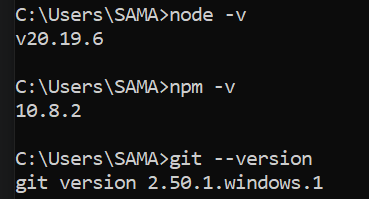
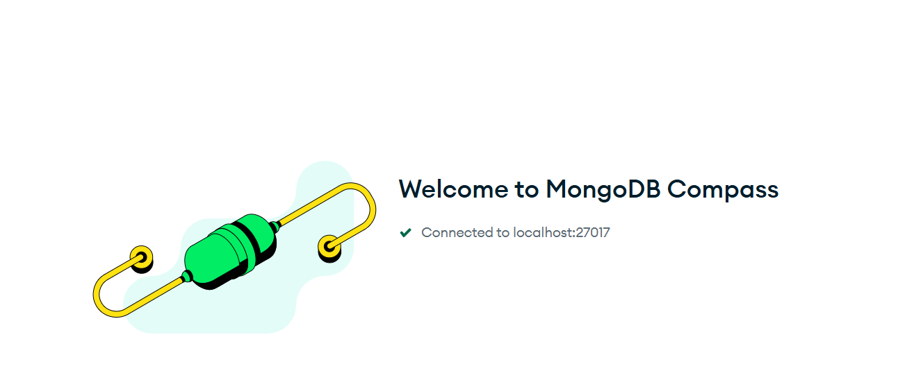
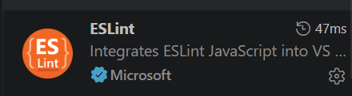
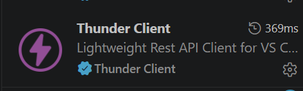
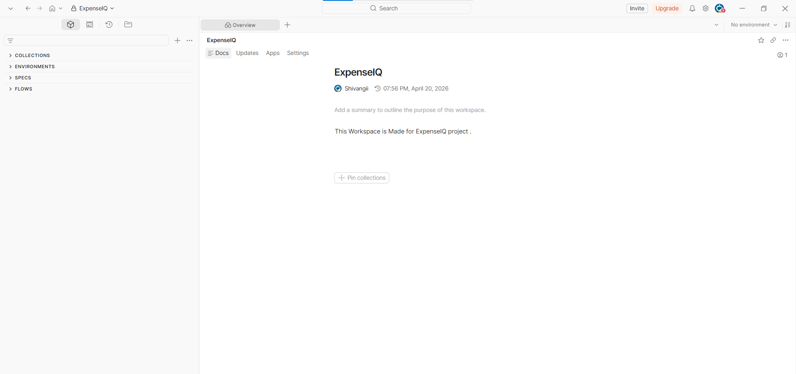

# 🛠️ Local Development Environment Setup Guide

**Project:** ExpenseIQ  
---

## Tools Required

| Tool | Version | Purpose |
|------|---------|---------|
| Node.js | v20.19.6 (LTS) | JavaScript runtime for backend |
| npm | 10.8.2 | Package manager |
| MongoDB Compass | latest | GUI for MongoDB database |
| VS Code | Latest | Code editor |
| Git | 2.50.1.windows.1 | Version control |
| Postman | Latest | API testing |

---

## 1. Node.js & npm
- Download from [nodejs.org](https://nodejs.org)
- Install the **LTS version**
- Verify:
```bash
node -v
npm -v
```
---

## 2. Git
- Download from [git-scm.com](https://git-scm.com)
- Verify:
```bash
git --version
```

---

## 3. MongoDB Compass
- Download from [mongodb.com/products/compass](https://www.mongodb.com/products/compass)
- Open the app → Connect using: `mongodb://localhost:27017`



---

## 4. VS Code
- Download from [code.visualstudio.com](https://code.visualstudio.com)
- Recommended Extensions:
  - ESLint
  - Thunder Client (optional, for API testing inside VS Code)

  


  
---

## 5. Postman
- Download from [postman.com](https://www.postman.com)
- Create a free account and set up a new Workspace: **ExpenseIQ**


---
7. Project Readiness Validation

After installing the required tools, verify the environment is ready for project setup:

VS Code launches successfully
MongoDB Compass opens and accepts local connection
Postman launches and workspace is accessible
Terminal recognizes Node.js, npm, and Git commands

This ensures the machine is prepared for cloning the repository, installing dependencies, and running the project locally.

---
## ✅ Setup Checklist

- [x] Node.js installed — v20.19.6
- [x] npm working — v10.8.2
- [x] Git installed — v2.50.1
- [x] MongoDB Compass installed and connected
- [x] VS Code installed with ESLint extension
- [x] Postman installed with ExpenseIQ workspace